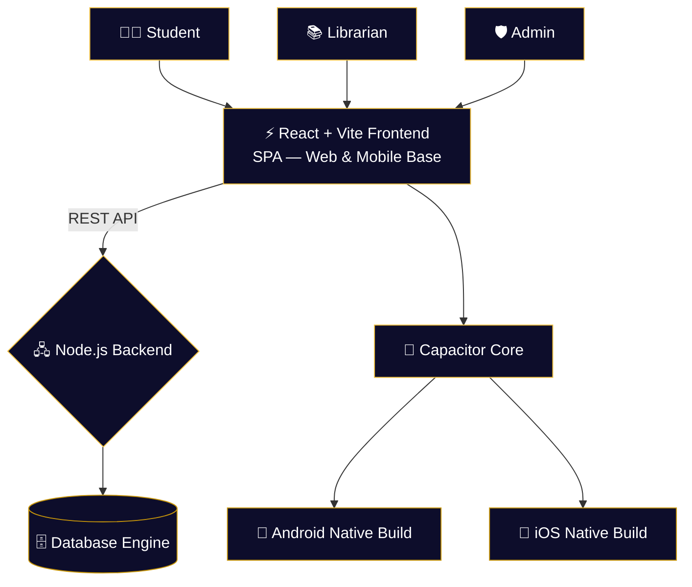

<div align="center">


<br/>

<p align="center">
  
</p>

<br/>

<p align="center">
  
  &nbsp;
  
  &nbsp;
  
  &nbsp;
  
</p>

<p align="center">
  
  
  
  
  
</p>

</div>

---

## What is Nexus?

Nexus is not just a library portal. It is a **unified intelligence layer for the entire campus**.

Traditional campus systems fragment students, librarians, and administrators into separate, disconnected tools. Nexus collapses that into a single platform — role-aware, cross-platform, and AI-assisted — so every actor in the institution operates from the same source of truth.

Write once. Deploy everywhere — **web, Android, and iOS** natively via Capacitor.

```
Student / Librarian / Admin
         │
         ▼
  React + Vite SPA  ──▶  Node.js REST API  ──▶  Database
         │
         ▼
  Capacitor Core
  ├── Android Native Build
  └── iOS Native Build
```

---

## Core Features

<table>
<tr>
<td width="50%">

### 🔐 Multi-Role Architecture
- Isolated dashboards for **Students**, **Librarians**, and **Admins**
- Protected routes — role verification at every layer
- Secure login via `AuthContext` global state
- No role can access another's environment

</td>
<td width="50%">

### 📱 True Cross-Platform
- React web app as the single source codebase
- **Capacitor** bridges web → native Android & iOS
- One build system, three deployment targets
- Mobile-native feel with web development speed

</td>
</tr>
<tr>
<td width="50%">

### 🤖 AI Assistant Integration
- Interactive `Chatbot` component built into the student view
- Instant answers for catalog queries & support
- Navigation assistance for first-time users
- Extensible to LLM backends

</td>
<td width="50%">

### 📊 Advanced Analytics
- Real-time telemetry across all roles
- Custom `BarChart`, `LineChart`, and `DonutChart` components
- Book circulation tracking
- Student metrics & transaction history dashboards

</td>
</tr>
</table>

<table>
<tr>
<td width="100%">

### ✨ Hyper-Modern UI/UX
- Animated background layers: `NeuralBackground`, `SpotlightBackground`, `FlowBackground`
- `EnhancedStatCard` for premium metric displays
- Dark-first, futuristic aesthetic — built with Tailwind CSS
- Motion-rich UI without sacrificing performance

</td>
</tr>
</table>

---

## System Architecture



---

## Role Modules

| Role | Dashboard | Capabilities |
|------|-----------|-------------|
| 👨‍🎓 **Student** | `StudentDashboard` | Browse catalog, view borrowed books, AI chatbot |
| 📚 **Librarian** | `LibrarianDashboard` | Manage inventory, approve requests, view circulation |
| 🛡️ **Admin** | `AdminDashboard` | System health, user management, global telemetry |

---

## Tech Stack

| Layer | Technology | Purpose |
|-------|-----------|---------|
| **Frontend** | React 18 · Vite · Tailwind CSS | SPA, routing, UI system |
| **Mobile** | Ionic Capacitor | Native iOS & Android compilation |
| **Backend** | Node.js · Express | REST API, auth, business logic |
| **Auth** | React Context · Protected Routes | Role-based access control |
| **Charts** | Custom components | Bar, Line, Donut telemetry visuals |
| **AI** | Chatbot component | Student query resolution |

---

## Project Structure

```
nexus_p1/
│
├── 📁 Backend/                   # Node.js Server & API
│   ├── index.js                  # Core server entry point
│   ├── routes/                   # API route handlers
│   ├── .env.example              # Environment config template
│   └── package.json
│
└── 📁 Frontend/                  # React SPA (Web + Mobile base)
    ├── 📁 android/               # Capacitor Android Native Project
    ├── 📁 ios/                   # Capacitor iOS Native Project
    ├── 📁 src/
    │   ├── api/                  # Axios interceptors & API calls
    │   ├── components/           # BookCard, Chatbot, animated backgrounds
    │   │   └── charts/           # BarChart, LineChart, DonutChart
    │   ├── context/              # AuthContext — auth & role state
    │   ├── layouts/              # Dashboard layout wrappers
    │   └── pages/                # Admin, Librarian, Student, Login views
    ├── capacitor.config.json     # Mobile build configuration
    ├── tailwind.config.js        # Design system
    └── vite.config.js            # Frontend bundler
```

---

## Getting Started

> **Prerequisites:** Node.js v18+ (v20 recommended) · npm/yarn/pnpm
> **Mobile (optional):** Android Studio for Android · Xcode for iOS

### ⚡ 1. Start the Backend

```bash
cd Backend

npm install

# Copy env template and fill in your DB credentials + secrets
cp .env.example .env

npm start
# → API running on http://localhost:3000
```

### 🖥️ 2. Start the Frontend

Open a new terminal:

```bash
cd Frontend

npm install

npm run dev
# → Web app at http://localhost:5173
```

---

### 📱 Mobile Builds (Capacitor)

```bash
cd Frontend

# Build the web app first
npm run build

# Sync to native projects
npx cap sync

# Open in native IDEs
npx cap open android   # → Android Studio
npx cap open ios       # → Xcode
```

---

## Service Map

| Service | Port | Description |
|---------|------|-------------|
| `frontend` | `:5173` | React web app (Vite dev server) |
| `backend` | `:3000` | Node.js REST API |
| `android` | — | Native build via Android Studio |
| `ios` | — | Native build via Xcode |

---

## Roadmap

- [x] Multi-role protected dashboard architecture
- [x] AI chatbot for student assistance
- [x] Real-time analytics (Bar, Line, Donut charts)
- [x] Capacitor iOS & Android native builds
- [x] Animated UI layer (Neural, Spotlight, Flow backgrounds)
- [ ] Push notifications (mobile)
- [ ] Offline mode with local sync
- [ ] QR code book check-in / check-out
- [ ] Email/SMS overdue alerts
- [ ] Fine management & payment integration

---

## Author

<p align="center">
  <a href="https://github.com/FOX-KNIGHT">
    
  </a>
  &nbsp;
  <a href="https://www.linkedin.com/in/siddhant-jena-457350389">
    
  </a>
  &nbsp;
  <a href="mailto:worksiddhant18@gmail.com">
    
  </a>
</p>

---

<div align="center">

> *"One system. Every role. Every device."*


</div>
